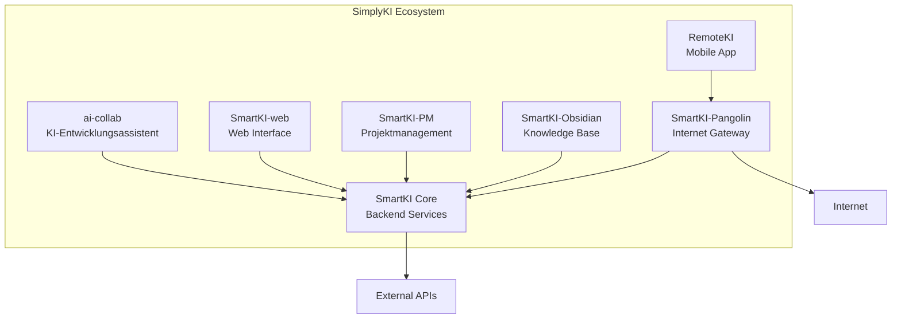

# SimplyKI - Das KI-Entwicklungs-Ecosystem

<div align="center">


**Intelligente Softwareentwicklung einfach gemacht**

[](https://github.com/stlas/SimplyKI)
[](LICENSE)
[](https://github.com/stlas/SimplyKI)

[🚀 Getting Started](#-getting-started) • [📚 Dokumentation](#-dokumentation) • [🛠️ Komponenten](#%EF%B8%8F-komponenten) • [💡 Features](#-features) • [🤝 Contributing](#-contributing)

</div>

---

## 🎯 Was ist SimplyKI?

SimplyKI ist ein umfassendes Open-Source Ecosystem für KI-gestützte Softwareentwicklung. Es vereint mehrere spezialisierte Tools und Services, die nahtlos zusammenarbeiten, um Entwicklern eine kostenoptimierte, effiziente und intelligente Entwicklungsumgebung zu bieten.

### 🌟 Kernprinzipien

- **🎯 Einfachheit**: Komplexe KI-Funktionen einfach nutzbar machen
- **💰 Kosteneffizienz**: Bis zu 90% Kostenersparnis durch intelligente Optimierung
- **🔧 Modularität**: Verwende nur die Komponenten, die du brauchst
- **🌐 Open Source**: Vollständig transparent und erweiterbar

## 🏗️ Ecosystem-Architektur



## 🛠️ Komponenten

### 1. [ai-collab](https://github.com/stlas/ai-collab) - KI-Entwicklungsassistent
Der Kern des Systems. Ein intelligenter Assistent, der:
- ✅ Automatisch das optimale KI-Modell auswählt
- ✅ Kosten um bis zu 90% reduziert durch Template-Optimierung
- ✅ Sessions und Kontext über Neustarts hinweg speichert
- ✅ Mit allen gängigen Programmiersprachen arbeitet

### 2. [SmartKI Core](https://github.com/stlas/SmartKI) - Backend Services
Microservices-Architektur für:
- 🔌 API Gateway mit intelligentem Routing
- 🔍 Service Discovery und Health Monitoring
- 🤖 AI Orchestration Hub
- 📊 Real-time Analytics

### 3. [SmartKI-web](https://github.com/stlas/SmartKI-web) - Web Interface
Modernes React-basiertes Frontend mit:
- 📊 Echtzeit-Dashboards
- 💬 WebSocket-basierte Updates
- 🌍 Multi-Language Support (DE/EN)
- 🎨 Dark/Light Theme

### 4. [SmartKI-PM](https://github.com/stlas/SmartKI-PM) - Projektmanagement
Kanboard-basiertes PM-System mit:
- 📋 Kanban-Boards für agile Entwicklung
- 🤖 Automatische Task-Erstellung aus KI-Sessions
- 💰 Kosten-Tracking pro Projekt
- 📈 Entwicklungszeit-Analysen

### 5. [SmartKI-Obsidian](https://github.com/stlas/SmartKI-Obsidian) - Knowledge Base
Wissensmanagement mit:
- 📝 Automatische Session-Dokumentation
- 🔗 Verknüpfung verwandter Entwicklungen
- 🏷️ Tag-basierte Organisation
- 🔍 Volltext-Suche

### 6. [SmartKI-Pangolin](https://github.com/stlas/SmartKI-Pangolin) - Internet Gateway
Sicherer Tunnel-Service für:
- 🔒 WireGuard VPN-Tunnels
- 🌐 Domain-basiertes Routing
- 🔐 SSL-Zertifikat-Management
- 📊 Bandwidth-Monitoring

### 7. [RemoteKI](https://github.com/stlas/RemoteKI) - Mobile SSH Terminal
Android App (iOS geplant) für:
- 📱 SSH-Zugriff von unterwegs
- 💻 Terminal-Emulation
- 📁 File Upload/Download
- 🔄 Session-Management

## 💡 Features

### Für Entwickler
- **🚀 Schnellstart**: In 5 Minuten einsatzbereit
- **🧠 Intelligente Unterstützung**: KI wählt optimale Lösungswege
- **💰 Kostenkontrolle**: Echtzeit-Budgetüberwachung
- **📈 Produktivität**: 60-70% schnellere Entwicklung

### Für Teams
- **👥 Kollaboration**: Gemeinsame Projekte und Wissensaustausch
- **📊 Transparenz**: Vollständige Entwicklungs-Historie
- **🎯 Projektmanagement**: Integrierte Task-Verwaltung
- **💼 Enterprise-Ready**: Skalierbar und sicher

### Für Unternehmen
- **💵 ROI**: Messbare Kosteneinsparungen
- **🔒 Sicherheit**: On-Premise Deployment möglich
- **📈 Analytics**: Detaillierte Nutzungsstatistiken
- **🔧 Anpassbar**: Vollständig customizable

## 🚀 Getting Started

### Schnellstart (5 Minuten)

```bash
# 1. Repository klonen
git clone https://github.com/stlas/SimplyKI.git
cd SimplyKI

# 2. Installer ausführen
./install.sh

# 3. API-Key konfigurieren
echo "ANTHROPIC_API_KEY=your-key-here" > .env

# 4. System starten
./start-simplyki.sh
```

### Docker-Installation (Empfohlen)

```bash
# Mit Docker Compose
docker-compose up -d

# Oder einzelne Services
docker run -d -p 3200:3000 simplyki/core:latest
docker run -d -p 3000:3000 simplyki/web:latest
```

## 📚 Dokumentation

### Schnellzugriff
- [🚀 Installation Guide](docs/INSTALLATION.md)
- [📖 Benutzerhandbuch](docs/USER-GUIDE.md)
- [🔧 API Dokumentation](docs/API.md)
- [🏗️ Architektur](docs/ARCHITECTURE.md)

### Tutorials
- [Erste Schritte mit ai-collab](docs/tutorials/FIRST-STEPS.md)
- [Projekt-Setup mit SmartKI-PM](docs/tutorials/PROJECT-SETUP.md)
- [Remote-Zugriff einrichten](docs/tutorials/REMOTE-ACCESS.md)

## 💰 Kostenbeispiel

Ein typisches Entwicklungsprojekt mit SimplyKI:

| Ohne SimplyKI | Mit SimplyKI | Ersparnis |
|---------------|--------------|-----------|
| $500/Monat | $50/Monat | 90% |
| 100h Entwicklung | 40h Entwicklung | 60% |
| Manuelles PM | Automatisiert | ∞ |

## 🗺️ Roadmap

### Q3 2025 ✅
- [x] Core System Release
- [x] Web Interface
- [x] Mobile App (Alpha)
- [x] Documentation

### Q4 2025 🚧
- [ ] Plugin Marketplace
- [ ] Cloud Hosting Option
- [ ] iOS App
- [ ] AI Model Marketplace

### 2026 📅
- [ ] Enterprise Features
- [ ] Multi-Region Support
- [ ] Advanced Analytics
- [ ] Custom AI Training

## 🤝 Contributing

Wir freuen uns über Beiträge! Siehe [CONTRIBUTING.md](CONTRIBUTING.md) für Details.

### Wie du helfen kannst
- 🐛 Bugs melden
- 💡 Features vorschlagen
- 📝 Dokumentation verbessern
- 🔧 Code beitragen
- 🌍 Übersetzen
- ⭐ Projekt starred

## 📊 Status & Statistiken

| Komponente | Version | Status | Tests | Coverage |
|------------|---------|--------|-------|----------|
| ai-collab | v2.1.3 | ✅ Stable | ✅ | 85% |
| SmartKI Core | v1.0.0 | ✅ Stable | ✅ | 78% |
| SmartKI-web | v1.0.0 | ✅ Stable | ✅ | 72% |
| RemoteKI | v0.1.0 | 🚧 Alpha | ⚠️ | 45% |

## 💬 Community & Support

- **Discord**: [SimplyKI Community](https://discord.gg/simplyki) (coming soon)
- **Forum**: [discuss.simplyki.com](https://discuss.simplyki.com) (coming soon)
- **Email**: support@simplyki.com
- **Twitter**: [@SimplyKI](https://twitter.com/simplyki)

## 📄 Lizenz

SimplyKI ist unter der MIT-Lizenz veröffentlicht. Siehe [LICENSE](LICENSE) für Details.

## 🙏 Danksagungen

Besonderer Dank an:
- Die Open Source Community
- Alle Contributors und Early Adopters
- Claude AI für die Unterstützung bei der Entwicklung

---

<div align="center">

**SimplyKI - Making AI-powered development simply powerful** 🚀

[Website](https://simplyki.com) • [Documentation](https://docs.simplyki.com) • [Blog](https://blog.simplyki.com)

</div>